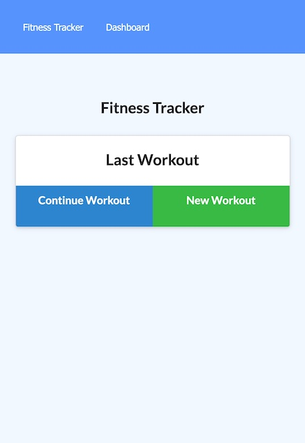
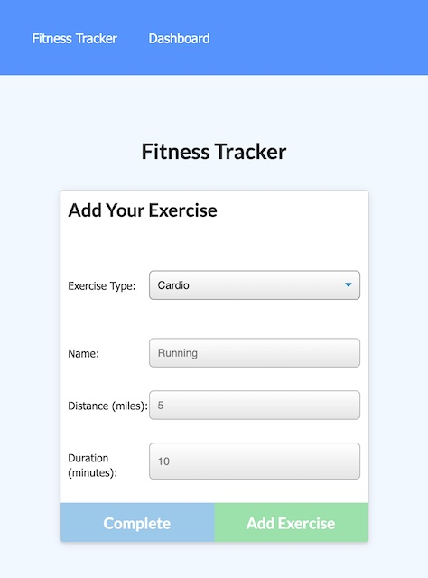
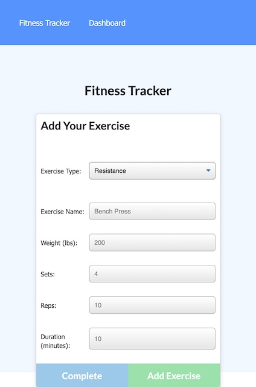

# nosql_workouttracker_vgutierrez

Project week 18 - Workout Tracker

# Description

This is a full stack tech blog that will allow a user to log in and track their workouts. A user can add new exercises or complete exercises they have already started. They can also view a dashboard that tracks their accomplishments.

# Table of Contents

- [Installation](#installation)
- [Usage](#usage)
- [License](#license)
- [Contributers](#contributers)
- [Test Instructions](#test-instructions)
- [Questions](#questions)

# Installation

This is the first installation of this tool.

# Usage

- This tool can be used to add and track workout achievements.

# License

- MIT

# Contributers

- Vinette Gutierrez

# Test Instructions

Check out the deployed page [here](https://pacific-reef-67259.herokuapp.com/)

# Questions

- [Github Link](https://github.com/vinetteg/nosql_workouttracker_vgutierrez)
- For additional questions, please contact me via email at vinette.gutierrez@gmail.com
